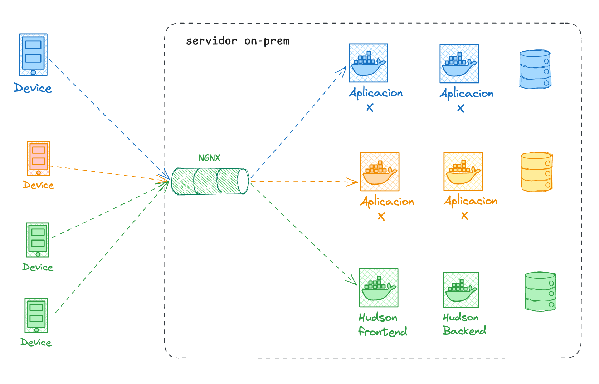
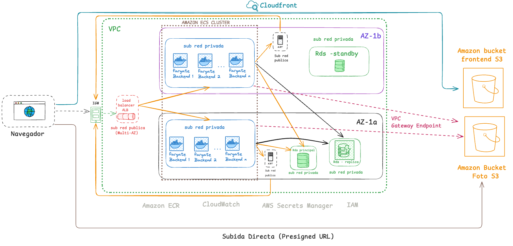

#### 1. Contexto y Estado Actual (As-Is)

**¿Qué es Hudson?**

Hudson es una plataforma integral B2B/B2C diseñada para centralizar y optimizar la gestión del ecosistema automotor. La aplicación conecta a propietarios de vehículos, mecánicos y talleres. Su objetivo principal es facilitar el trabajo diario mediante la creación de un "historial clínico" detallado e inmutable de cada vehículo.

Para los talleres, Hudson provee herramientas analíticas y métricas precisas sobre los tipos de reparaciones realizadas, mejorando sustancialmente su eficiencia operativa. Simultáneamente, para la administración central, la plataforma funciona como un gestor estratégico para la venta de autopartes, permitiendo ejecutar campañas de fidelización y ofrecer descuentos dinámicos a los talleres durante sus picos de demanda o volumen de trabajo.

**1. Estado Actual (As-Is)**

Actualmente, la plataforma "Hudson" se encuentra operando bajo una arquitectura de Producto Mínimo Viable (MVP) desplegada en un entorno local (on-premise), compartido y monolítico. Si bien este enfoque permitió validar el modelo de negocio con los primeros talleres, presenta severas vulnerabilidades arquitectónicas de cara a la expansión nacional del servicio:

- **Infraestructura de Cómputo No Aislada:** El sistema (tanto el frontend web como las APIs del backend) se ejecuta en contenedores Docker dentro de una única Máquina Virtual (VM) compartida con otros proyectos. Este modelo sufre por picos de demanda en aplicaciones ajenas degradan el rendimiento de Hudson. Además, un único servidor NGINX centraliza todo el tráfico, constituyendo un Punto Único de Fallo . Ante el aumento proyectado de actividad en horario comercial (8:00 AM a 20:00 PM), esta VM colapsará por falta de recursos (CPU/RAM).
- **Gestión de Datos y Riesgo de Pérdida:** El motor de base de datos relacional opera actualmente sobre un volumen local montado en la misma instancia física. Este acoplamiento representa un riesgo crítico de pérdida de datos (historial de clientes, facturación y vehículos) en caso de corrupción del disco o fallo de hardware. Adicionalmente, las consultas analíticas pesadas requeridas por la administración compiten por los mismos recursos que las operaciones transaccionales diarias de los talleres, generando latencia en la aplicación.
- **Cuello de Botella en Almacenamiento (Firebase):** Los recursos multimedia (fotos de vehículos, comprobantes y cédulas verdes) se almacenan en el *Free Tier* de Firebase Storage. La cuota de 5 GB resulta insuficiente para un despliegue masivo.

 

  

  <em>Figura 1: Arquitectura actual de Hudson (MVP) en servidor local compartido.</em>

 

---

### 2. Arquitectura Propuesta (To-Be) y Decisiones de Diseño

Para soportar el tráfico nacional de forma elástica, segura y costo-eficiente, se propone una migración hacia una arquitectura orientada a contenedores y bases de datos gestionadas en AWS, alineada con las mejores prácticas de la industria.

Basándonos en la naturaleza de nuestros servicios contenedorizados y un patrón de tráfico **sostenido y variable** durante el día, optamos por servicios *Serverless* para contenedores, descartando EC2 (para evitar la sobrecarga operativa de gestionar parches de sistemas operativos y para no pagar por capacidad ociosa durante la noche.) y descartando Lambda (dado que el backend es un monolito de larga duración y su diseño específico para eventos esporádicos no se alinean ).

- **Frontend (React SPA Serverless):** La aplicación cliente, desarrollada en React, se dejará de servir desde contenedores tradicionales. En su lugar, los archivos estáticos compilados se alojarán de forma nativa en un bucket de Amazon S3. Se implementará **Amazon CloudFront** como Red de Entrega de Contenidos (CDN) global por delante de S3, garantizando tiempos de carga de milisegundos a nivel nacional, provisión automática de certificados HTTPS y protección del bucket contra accesos directos.
- **Backend (Monolito Docker):** La imagen actual del backend se orquestará mediante **Amazon ECS utilizando AWS Fargate**. Estará posicionado detrás de un **Application Load Balancer (ALB)**, el cual actuará como la única puerta de entrada. Optamos por Fargate para evitar la gestión de servidores subyacentes (EC2) y porque nuestro backend tiene procesos de larga duración que no se adaptan al modelo de AWS Lambda. F
- **Auto-Scaling Horizontal:** Se configurarán políticas de escalado en CloudWatch. Si el uso de CPU promedio de los contenedores supera el 70% durante los picos de mayor concurrencia de usuarios activos, Fargate clonará automáticamente las tareas (Scale-Out) para absorber el pico, y las destruirá durante la noche (Scale-In) para optimizar costos.

#### 2.1. Capa de Datos Gestionada y Segregación (Amazon RDS)

Se desacoplará la persistencia de datos migrando a **Amazon RDS PostgreSQL 16** en configuración *Multi-AZ* para garantizar alta disponibilidad ante fallos de centros de datos.

- **Migración y Sanitización del MVP:** Previo a la puesta en producción definitiva, se ejecutará un proceso estructurado para extraer los datos del MVP actual. Este paso incluirá la **sanitización y normalización** de la información histórica (limpieza de registros duplicados, estandarización de formatos de patentes, eliminación de datos huérfanos), asegurando que la nueva infraestructura reciba una base de datos íntegra, segura y optimizada para el crecimiento a escala nacional.
- **Alta Disponibilidad (Multi-AZ):** La base de datos principal se desplegará con un clúster Standby. AWS mantendrá una copia exacta y sincrónica en una zona de disponibilidad distinta. Ante un fallo catastrófico de hardware, RDS realizará un Failover automático sin pérdida de datos ni intervención humana.
- **Estrategia de Réplica de Lectura (Read Replica):** Para evitar que el panel de administración bloquee la base de datos transaccional, se implementará una Réplica de Lectura asíncrona. Los contenedores de Fargate (usuarios/talleres) escribirán y leerán en el nodo principal, mientras que el código identificará las consultas analíticas pesadas del Administrador y las redirigirá exclusivamente a la réplica.

#### 2.2. Capa de Almacenamiento Inteligente (Amazon S3)

Se reemplazará Firebase por buckets privados en **Amazon S3**, resolviendo las limitaciones de cuota y asegurando la privacidad de los documentos legales.

- **Patrón de Subida Directa (Presigned URLs):** El backend generará URLs firmadas temporalmente. Los dispositivos móviles subirán las imágenes pesadas (4K) directamente a S3, esquivando los contenedores de Fargate y el ALB, ahorrando ancho de banda y capacidad de cómputo.
- **Optimización de Costos (Storage Tiering):** Dado que los informes históricos rara vez se consultan, se configurarán **Reglas de Ciclo de Vida**. Mediante la lectura de prefijos, los objetos en la ruta `informes/` transicionarán automáticamente hacia capas de almacenamiento económicas (Standard-IA o Glacier) tras 8 meses. Por el contrario, las imágenes bajo la ruta `autos/` (fotos de perfil de flotas) permanecerán en la capa Standard para carga inmediata.

#### 2.3. Diseño de Red, Seguridad y Alta Disponibilidad (Amazon VPC)

Para garantizar el aislamiento de los datos y el cumplimiento de las normativas de seguridad, la arquitectura se desplegará dentro de una Red Privada Virtual (Amazon VPC) estructurada en un bloque CIDR principal `10.0.0.0/16` segmentado en capas (Pública, Aplicación y Datos) distribuidas en dos Zonas de Disponibilidad (Multi-AZ) para tolerancia a fallos.

- **Subredes Públicas (Capa de Entrada):** Alojarán exclusivamente los componentes que requieren salida directa a internet, como los NAT Gateways y los nodos del Application Load Balancer (ALB).
- **Subredes Privadas (Capa de Aplicación y Datos):** Los contenedores de ECS Fargate y las bases de datos RDS operarán estrictamente en subredes privadas, sin IPs públicas asignadas, bloqueando cualquier intento de acceso directo desde el exterior.
- **Tráfico Interno Seguro:** La comunicación entre Fargate y S3 (para guardar las fotos) se realizará a través de un ***VPC Gateway Endpoint***, garantizando que los datos sensibles viajen por la red troncal privada de AWS sin exponerse al internet público.

**Tabla de Segmentación de Red (Subnetting):**
Se asignaron bloques `/24` para permitir una escalabilidad holgada (hasta 251 recursos simultáneos por capa), reservando el resto de la VPC para futuras expansiones del negocio

| **Zona de Disp.** | **Capa Lógica** | **Componentes Alojados** | **Bloque CIDR** |
| --- | --- | --- | --- |
| **AZ-1a** | Pública | NAT Gateway 1, Nodo ALB | `10.0.1.0/24` |
| **AZ-1a** | Privada (App) | ECS Fargate Backend (Mitad de tráfico) | `10.0.2.0/24` |
| **AZ-1a** | Privada (Datos) | RDS Principal, RDS Réplica (Reportes) | `10.0.3.0/24` |
| **AZ-1b** | Pública | NAT Gateway 2, Nodo ALB | `10.0.4.0/24` |
| **AZ-1b** | Privada (App) | ECS Fargate Backend (Mitad de tráfico) | `10.0.5.0/24` |
| **AZ-1b** | Privada (Datos) | RDS Standby (Alta Disponibilidad) | `10.0.6.0/24` |

 

  

  <em>Figura 2: Arquitectura en la nube de AWS propuesta para Hudson (VPC Multi-AZ, ECS Fargate, RDS PostgreSQL Multi-AZ, VPC Gateway Endpoint y S3 Presigned URLs).</em>

 

---

### 3. Objetivos SMART de la Migración

- **Específico (S):** Migrar la infraestructura completa de Hudson (Frontend, Backend, Base de Datos y Almacenamiento) desde el entorno local hacia servicios gestionados en AWS.
- **Medible (M):** Lograr un 99.9% de disponibilidad (Uptime) y reducir el tiempo de respuesta del backend a menos de 200ms en el percentil 95 durante los picos de las 18:00 hs.
- **Alcanzable (A):** Utilizar imágenes Docker existentes para minimizar la refactorización de código, apoyándose en Fargate y S3 + CloudFront.
- **Relevante (R):** Eliminar el riesgo de pérdida de datos y soportar la carga simultánea de 10000 informes diarios sin degradación del servicio ni cuellos de botella analíticos.
- **Temporal (T):** Completar el despliegue y corte final a producción en un plazo de 8 semanas.

### 4. Cronograma de Implementación (Fases)

- **Fase 1 (Semanas 1-2) - Almacenamiento y Seguridad:** Creación de los buckets S3, configuración de políticas de acceso estricto, Reglas de Ciclo de Vida y modificación del código backend para soportar generación de *Presigned URLs*.
- **Fase 2 (Semanas 3-4) - Capa de Datos:** Despliegue de Amazon RDS Multi-AZ y configuración de la Read Replica. Migración de los datos históricos desde el volumen Docker local hacia la nueva instancia en la nube.
- **Fase 3 (Semanas 5-6) - Capa de Cómputo:** Subida de las imágenes a Amazon ECR. Despliegue del Frontend estático en S3 y configuración de la CDN en CloudFront y ECS Fargate (Backend) junto con el Application Load Balancer y las alarmas de Auto-Scaling.
- **Fase 4 (Semanas 7-8) - Pruebas y Go-Live:** Ejecución de pruebas de carga para validar el escalado horizontal. Apagado paulatino del servidor NGINX local y redirección final de los registros DNS hacia la nueva infraestructura en AWS. Monitoreo intensivo de las primeras 48 horas.